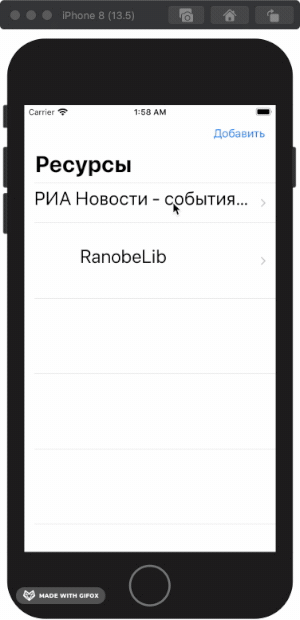

# Otus Scraping

Курсовая работа по курсу занятий Otus. Программа проводит scraping HTML страницы по заданным правилам и отображает пользователю. Данный метод позволяет получить информацию с интернет-ресурса и преобразовать полученную информацию в любой другой вид.

В коде приведен пример получения данных из ресурса: https://ranobelib.me

## Внешние библиотеки

Для реализации функционала приложения была использована библиотека SwiftSoup: https://github.com/scinfu/SwiftSoup

## Пример работы

